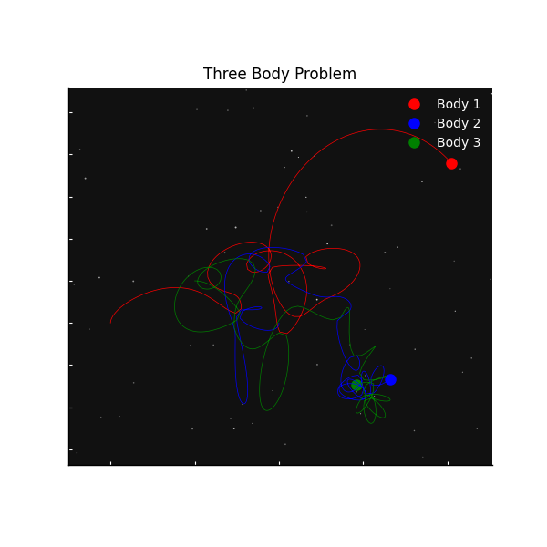
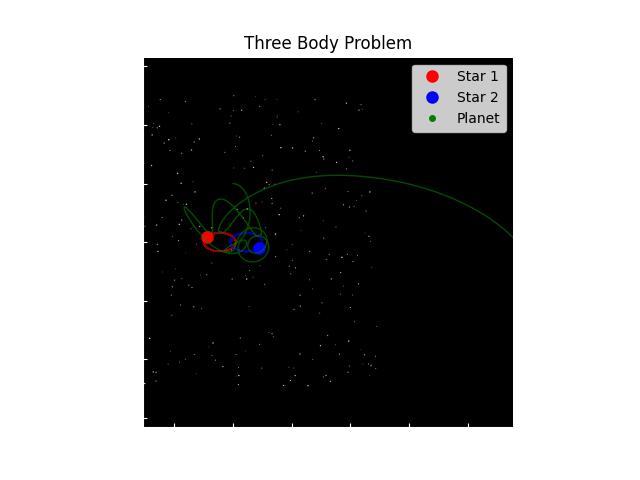
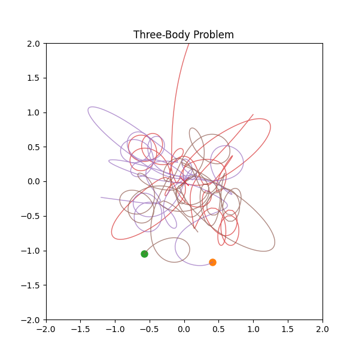

# three-body-problem-simulation

## Overview

In physics and classical mechanics, the **Three Body Problem** refers to the challenge of determining the future motion of three point masses given their initial positions and velocities, according to **Newton’s laws of motion** and **Newton’s law of universal gravitation**.

The three-body problem is a special case of the **N-body problem**, which studies the motion of multiple bodies interacting through gravitational forces.

Unlike the **two-body problem**, which has exact analytical solutions, the three-body problem **does not have a general analytical solution**. Because of this, the motion must be studied using **numerical simulations**.

Small changes in the initial conditions can lead to completely different trajectories, which makes the system **chaotic and highly sensitive to initial conditions**.

---

## Historical Background

The first classical example of a three-body system involved the **Sun, Earth, and Moon**.

In *Principia* (1687), **Isaac Newton** studied the gravitational interaction between these bodies. However, the complexity of the three gravitational forces prevented him from finding a complete analytical solution.

Later, **Leonhard Euler** discovered special collinear solutions where the three bodies remain aligned.

**Joseph-Louis Lagrange** later identified solutions where the three bodies form an **equilateral triangle**, leading to the discovery of the **five Lagrange points (L1–L5)**.

In the late 19th century, **Henri Poincaré** proved that a general analytical solution does not exist and showed that the three-body system is extremely sensitive to initial conditions. His work laid the foundation of **chaos theory**.

---

## Physical Model

The motion of the bodies is governed by **Newton's law of universal gravitation**:

F = -G (m₁m₂ / r³) r

Where:

- **G** – gravitational constant  
- **m₁, m₂** – masses of the bodies  
- **r** – distance vector between the bodies  

Each body experiences gravitational attraction from the other two bodies.

The equations describing the motion are:

Position equation:

dr/dt = v

Acceleration equation:

a = F / m

For a three-body system, the acceleration of each body depends on the gravitational forces produced by the other two bodies.

---

## Numerical Method

Because the system has **no general analytical solution**, the equations must be solved numerically.

In this project, the system of differential equations is solved using the **Runge–Kutta 5(4) method**, implemented in the SciPy function: 
solve_ivp()

This method integrates the equations of motion and calculates the trajectories of the bodies over time.

---

# Simulated Cases

## Case 1 – Three Bodies with Equal Masses

In the first simulation, all three bodies have **equal masses** and interact gravitationally.

Each body is simultaneously attracted by the other two. Because of these interactions, the motion becomes **chaotic and unpredictable**.

Sometimes one body can gain enough energy to be **ejected from the system**, while the other two form a temporary binary system.

Small variations in initial conditions can lead to completely different trajectories.

### Result

---

## Case 2 – Binary Star System with a Planet

In this simulation, two bodies represent **stars with equal mass**, while the third body represents a **planet with a much smaller mass**.

The gravitational attraction between the two stars dominates the system, forming a relatively **stable binary orbit**.

The planet moves under the influence of both stars and may experience a **gravitational slingshot effect**, which can accelerate it and push it away from the system.

### Result

---

## Case 3 – Motion Relative to the Center of Mass

In the third simulation, the three bodies are initially placed in a **triangular configuration** and start **from rest**.

Even with simple initial conditions, the gravitational interactions generate **complex and unpredictable trajectories**.

To better visualize the motion, the system is recentered so that the **center of mass remains fixed at the origin (0,0)**.

### Result

---

## Technologies Used

- Python
- NumPy
- SciPy
- Matplotlib

---

## Conclusion

The three-body problem demonstrates how simple physical laws can generate extremely complex behavior.

Even though the equations describing the system are simple, their solutions are highly sensitive to initial conditions and often chaotic.

Numerical simulations allow us to study and visualize these complex gravitational interactions.
